# 三大元器件

## 光圈

1、是什么：

是控制镜头进光量的元器件，光圈越大，进光量越多，拍出来的照片越亮；

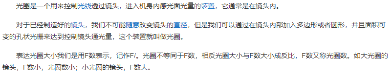

2、光圈大小：

光圈的作用在于决定镜头的进光量。在快门不变的情况下：

F后面的数值越小，光圈越大，进光量越多，画面比较亮，焦平面越窄，主体背景虚化越大；

F后面的数值越大，光圈越小，进光量越少，画面比较暗，焦平面越宽，主体前后越清晰。

3、手机光圈：

只有专业相机才支持调节光圈大小，数码相机和手机不支持调节光圈大小，因为手机内部空间很小，没有多余空间放一个可调节光圈，因此手机光圈是固定大小的。

## 传感器

1、是什么：

是一个感光元件，通俗来说，光线进入镜头后，照射在传感器上，传感器将光线绘制成图像并显示在胶卷上。

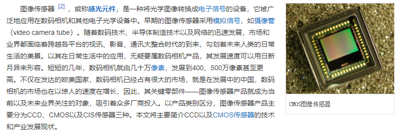

2、感官度ISO：

表示传感器对光线的敏感程度，ISO越大，对光线越敏感，图像越亮；

感光度低拍的画面清晰，感光度高拍的画面有很多噪点；

## 快门

1、是什么：

快门是相机中用来控制光线照射传感器时间的元器件，在设定的曝光时间结束前，要保持相机静止，否则图像会模糊；

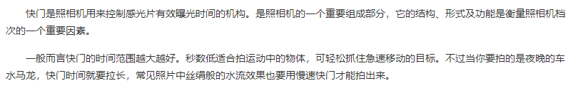

2、快门时间：

时间越长，进光量越多，照片越亮；

## 光圈、ISO、快门曝光三角

三者处于此消彼长的关系，三者共同决定了一张照片的曝光，也被称作为三角关系。

# 欠曝、过曝、糊片、噪点

## 欠曝

1、原因：

- 进光量太少，导致照片很黑；

2、解决办法：

增加进光量；

- 增大光圈；(手机不行)
- 提高ISO；
- 延长快门时间；

## 过曝

1、原因：

- 进光量太多，导致照片一片白色；

2、解决办法：

减少进光量；

- 缩小光圈；(手机不行)
- 降低ISO；
- 缩短快门时间；

## 糊片

1、原因：

- 拍摄物体运动速度过快；
- 手抖；

2、解决办法：

- 提高快门速度；
- 稳定相机；(使用三脚架)

## 噪点

1、原因：

- 黑暗环境中拍摄导致ISO太高；

2、解决办法：

- 手动降低ISO并延长快门速度；
- 人为补光，增加环境亮度；

# 测光

## 是什么

当点击屏幕上的某个位置，手机就会以这个点的明暗程度作为参考标准去曝光；

缺点：这种方式常常会使一张照片的某个地方过曝，某个地方欠曝；

解决方式下面几种：

- HDR；
- 曝光补偿；

## HDR

1、是什么：

高动态范围功能，适合拍摄画面相对稳定而又存在较大明暗反差的场景；

2、原理：

- 手机连续拍摄一系列曝光值不同的照片；
- 把每张照片里正常曝光的部分保留下来；
- 合成这些部分为一张照片；

## 曝光补偿

认为调节光量；

手机聚焦后，旁边的小太阳就是曝光补偿了。

# 光线与阴影

## 顺光、逆光、侧光

顺光可以让拍摄物体纤毫毕现，缺点就是没有阴影，使得物体不够立体，显得非常平；

测光会有阴影，有明有暗，明暗部使得拍摄很立体；

逆光会带来强烈的光照，很容易勾勒出物体的轮廓以及元素线条，拍摄剪影常常使用逆光；

## 光线强度

### 直射和散射

直射比较粗糙，散射比较温和；一般可以采用窗帘挡光的方式形成散射的效果；

### 冷暖对比的视觉冲击

通过控制色温来形成冷暖对比的效果；

# 构图

## 黄金分割点趣味中心构图法则

适合单一主体；

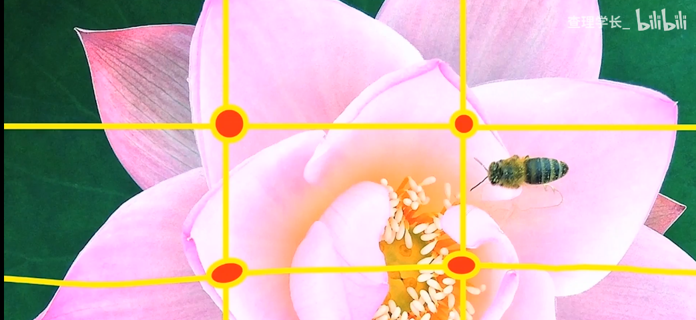

## 三分法

如上分为三部分。适合主体不是那么清楚的风景照；

## 对称法

适合比较庄严、严肃、稳定的环境氛围。

## 三角形法则

适合主体较多的情况，给人一种稳定的空间感。

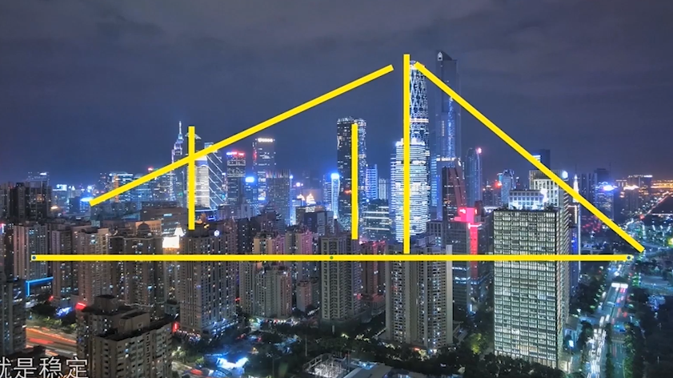

## 空间纵深与引导线

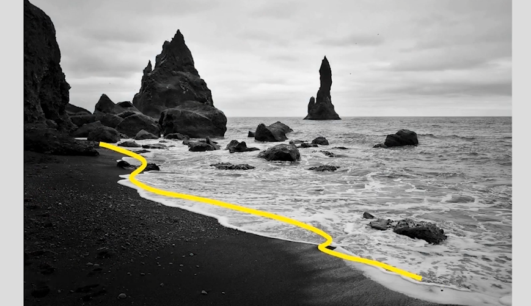

## 前中后景

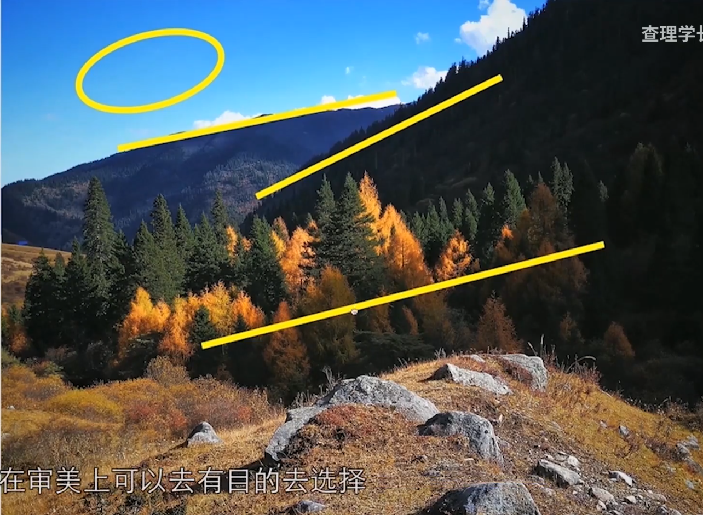

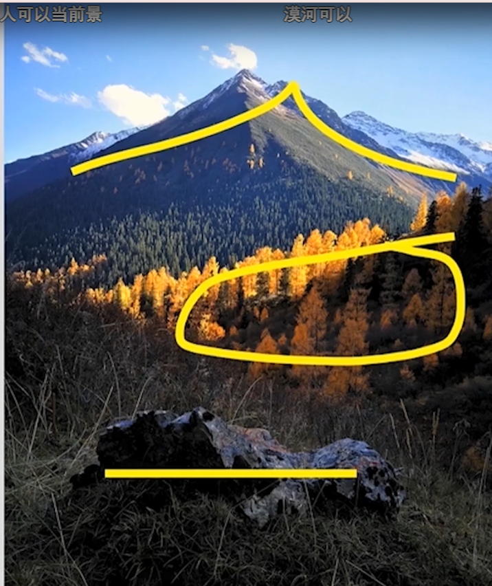

## 重复与节奏

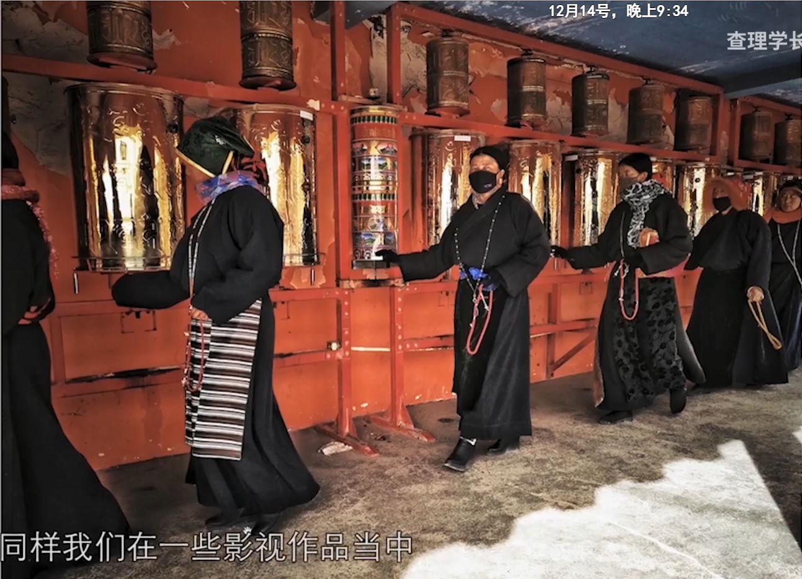

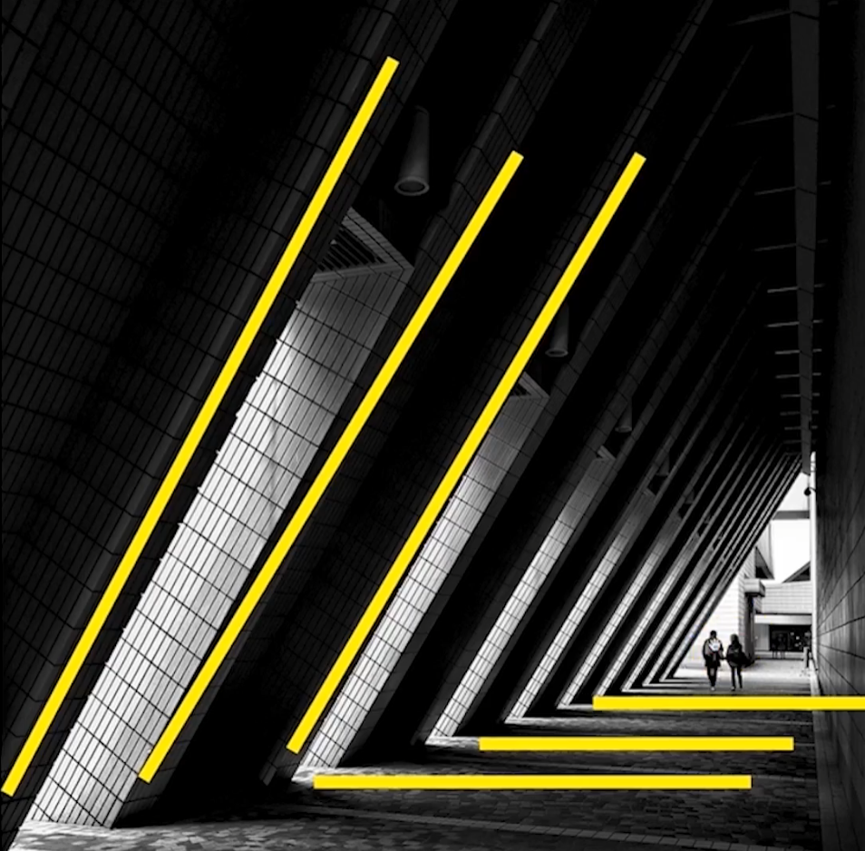

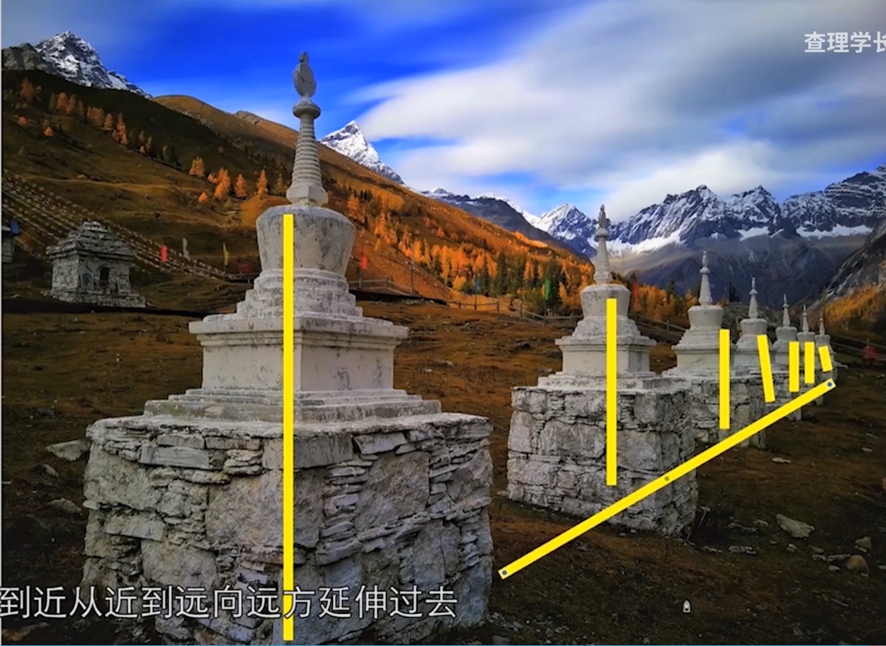

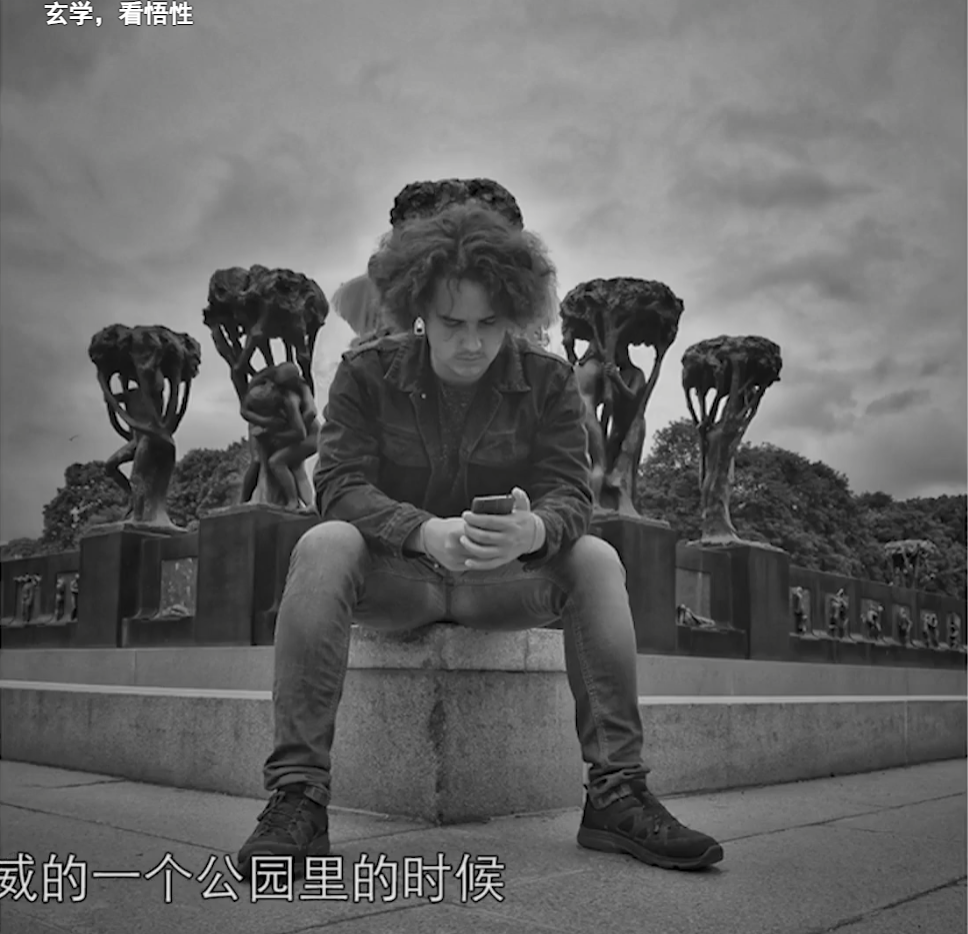

## 对比和类比

不同的东西在画面中形成一种对峙与矛盾的关系。

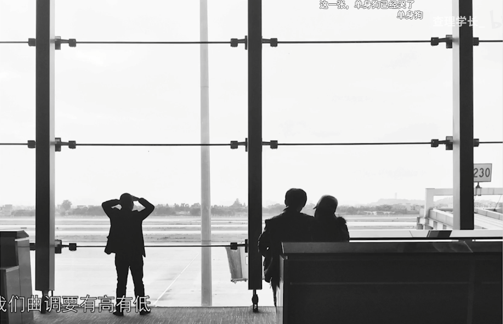

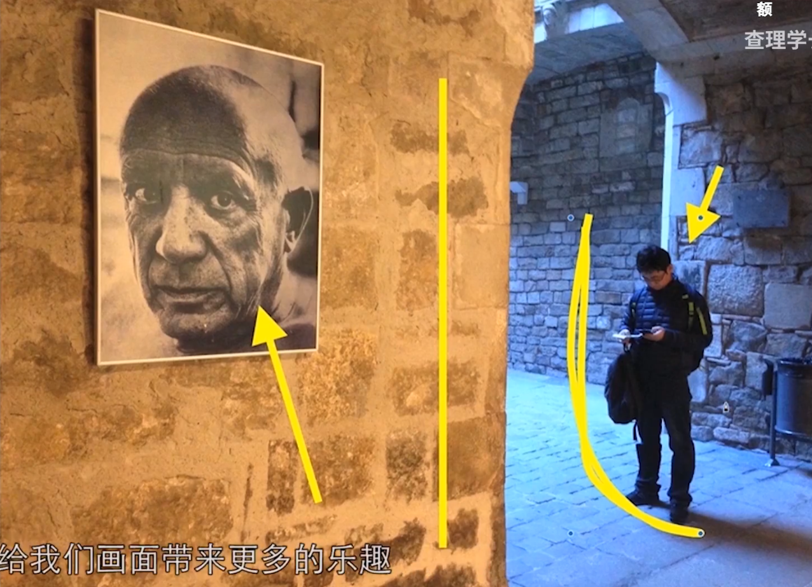

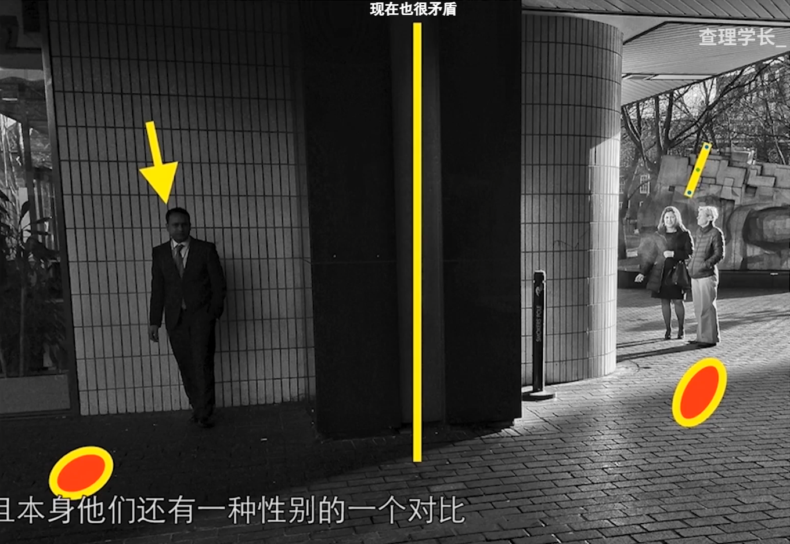

